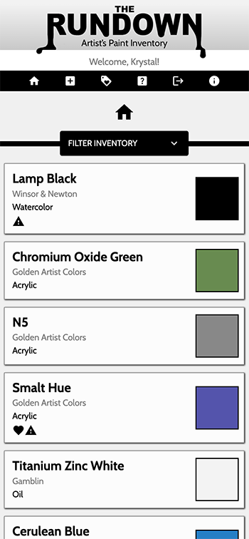
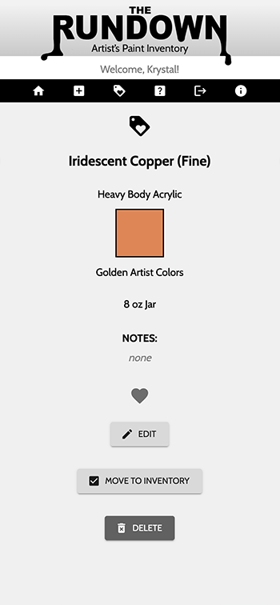
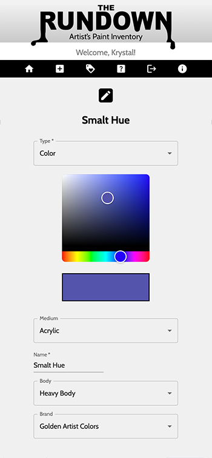

# The RUNDOWN
This app allows users to inventory and wishlist a variety of artist's paint supplies, such as colors, mediums, and varnishes.  A color picker allows the user to choose a color that represents each listing on the home page, and icons denote materials that are marked toxic or as a favorite.  Each listing is fully editable, and items can be moved back and forth between the wishlist and inventory.  Happy painting!

## Screenshots






## Prerequisites

This app uses React, Redux, Express, Passport, and PostgreSQL (a full list of dependencies can be found in `package.json`).

Before you get started, make sure you have the following software installed on your computer:

- [Node.js](https://nodejs.org/en/)
- [PostrgeSQL](https://www.postgresql.org/)
- [Nodemon](https://nodemon.io/)

Using Postico to view and manage the database is recommended.

## Create database and table

Create a new database called `artist_inventory` and create a `user` table:

```SQL
CREATE TABLE "user" (
    "id" SERIAL PRIMARY KEY,
    "username" VARCHAR (80) UNIQUE NOT NULL,
    "password" VARCHAR (1000) NOT NULL
);
```
and an `inventory` table:

```SQL
CREATE TABLE "inventory" (
    "id" SERIAL PRIMARY KEY,
    "user_id" INT REFERENCES "user",
    "type" VARCHAR (100) NOT NULL,
    "name" VARCHAR (100),
    "hex" VARCHAR (10),
    "medium" VARCHAR (100),
    "brand" VARCHAR (100),
    "body" VARCHAR (100),
    "container" VARCHAR (100),
    "size" VARCHAR (100),
    "notes" VARCHAR (1000),
    "favorite" BOOLEAN,
    "line" VARCHAR (100),
    "wishlist" BOOLEAN,
    "opacity" INT
);
```

## Install Instructions

- Run `npm install`
- Start postgres.
- Run `npm run server`
- Run `npm run client`
- Navigate to `localhost:3000` in your browser.

## Usage

Register as a new user or log in if you have already made an account.

The home screen shows your entire inventory, and the wishlist page shows all wishlisted items.  Click the filter bar on either to filter listings by type, medium, and/or brand, and to choose to see favorites only.

Clicking on any item in the inventory or wishlist brings you to a view of all the item's details, where you can favorite/unfavorite by clicking the heart icon.  Buttons on this view allow you to edit or delete the item, as well as move it between the inventory and wishlist.

The add screen allows entry of new items to the inventory or wishlist, and a message lets the user know if the addition was successful.

Click the exit icon in the nav bar to log out of the app.

## Contributors
Krystal Frost

## License
This project is licensed under the MIT License - see the LICENSE.md file for details.

## Acknowledgments
Thanks to Prime Digital Academy and anyone I've ever painted.
